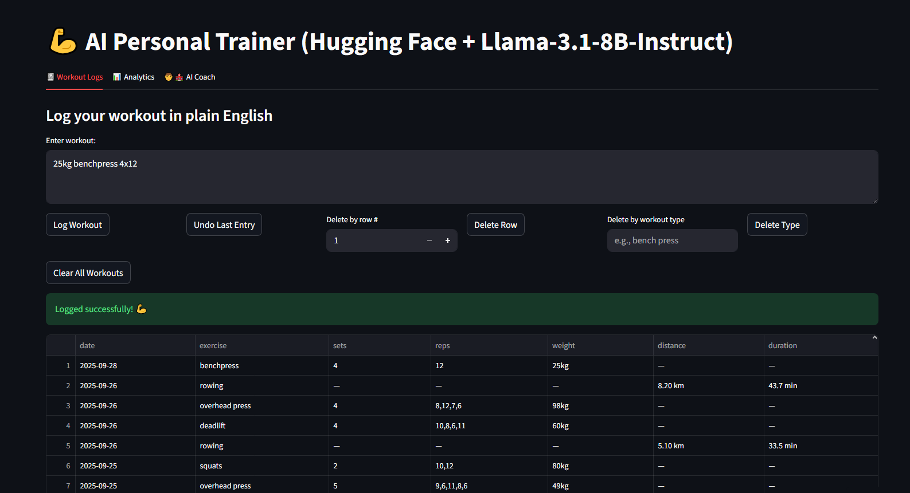
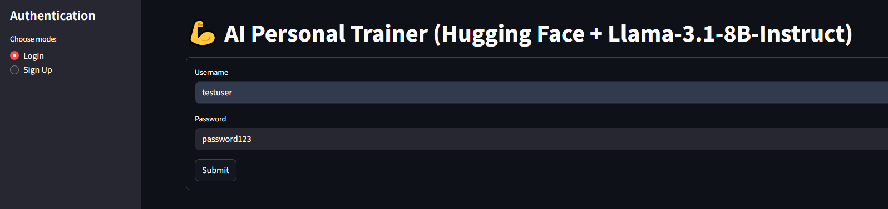
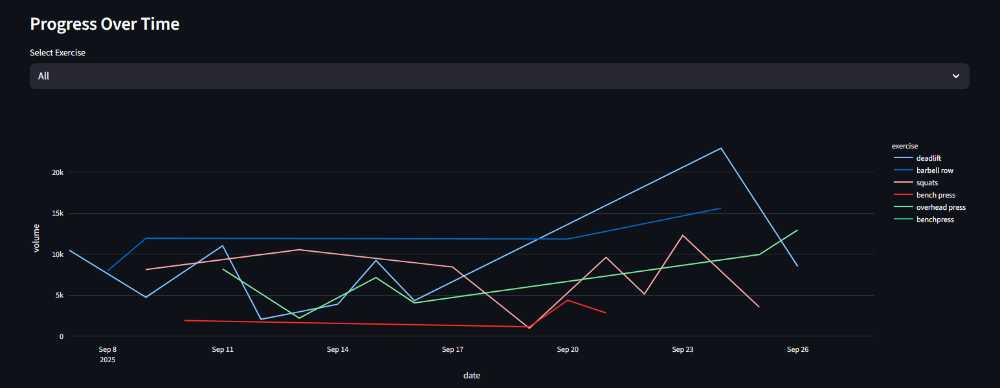
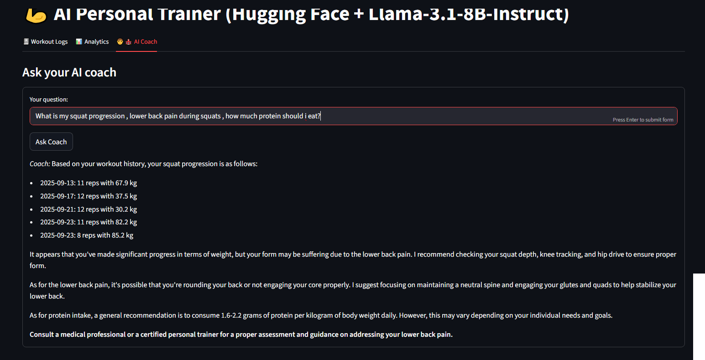

# 💪 AI Personal Trainer

An AI-powered personal trainer built with **Streamlit**, supporting **workout logging, analytics, and AI-driven coaching**.  
You can run it in **two modes**:
- **Local (`app.py`)** → Runs on your machine using [Ollama](https://ollama.ai) with the `mistral` model.  
- **Cloud (`app2.py`)** → Uses the Hugging Face Inference API (no local model needed).  

---

## 🚀 Features
- **Workout Logging**  
  - Input workouts in plain English (e.g., *“10 pushups, bench press 50kg x 3 sets, 5 km run in 25 min”*).  
  - Supports **strength** (sets, reps, weight) and **cardio** (distance, duration).  
  - Automatic parsing and structured storage.  
  

- **Authentication System**  
  - Sign up & log in with username + password (securely hashed).  
  - Each user has isolated workout history.  
  

- **Analytics Dashboard**  
  - Training split (strength vs cardio sessions).  
  - **Strength progress** via *training volume* (sets × reps × weight).  
  - **Cardio progress** via *distance* or *pace (min/km)* toggle.  
  - Personal Records (PRs): best lifts, longest runs, fastest times.  
  

- **AI Coach**  
  - Training progression recommendations.  
  - Nutrition guidance.  
  - Safe tips for injury prevention.  
  - Exercise form corrections.  
  - Encouraging, concise responses.  
  

- **Database Seeding**  
  - Pre-loads sample workouts for quick testing (`seed_db.py`).  

---

## 📂 Project Structure
```
├── app.py          # Local mode (Ollama + Mistral)
├── app2.py         # Cloud mode (Hugging Face)
├── llm.py          # Local LLM wrapper
├── llm2.py         # Hugging Face API wrapper
├── db.py           # Database logic (users + workouts)
├── parsing.py      # Text parsing helpers
├── seed_db.py      # Insert random test workouts
├── requirements.txt
└── README.md
```

---

## 📦 Installation
```bash
# Clone repo
git clone https://github.com/yourusername/ai-personal-trainer.git
cd ai-personal-trainer

# Install dependencies
pip install -r requirements.txt
```

---

## 🔑 Cloud Mode (Hugging Face)
1. Get a Hugging Face API key: [Generate here](https://huggingface.co/settings/tokens).  
2. Add it to `.streamlit/secrets.toml`:
   ```toml
   HUGGINGFACE_API_KEY="your_key_here"
   ```
3. Run:
   ```bash
   streamlit run app2.py
   ```

---

## 🖥️ Local Mode (Ollama + Mistral)
1. Install [Ollama](https://ollama.ai).  
2. Pull the mistral model:
   ```bash
   ollama pull mistral
   ```
3. Run:
   ```bash
   streamlit run app.py
   ```

---

## 🔧 Database
- Uses SQLite (`trainer.db`).  
- Tables auto-created with `init_db()`.  
- To seed with sample workouts:
  ```bash
  python seed_db.py
  ```
- Default test user:
  ```
  Username: testuser
  Password: password123
  ```

---

## 📊 Example Analytics
- **Strength** → Training volume trend (kg × reps × sets).  
- **Cardio** → Distance or Pace toggle.  
- **Split** → Strength vs cardio sessions this week.  
- **PRs** → Highest weights, longest runs, fastest paces.  


---

## 🙌 Notes
- Local mode requires Ollama installed separately.  
- Hugging Face mode may be rate-limited on free API keys.  
- Extendable: add new exercise types, integrate wearables, or connect external APIs.  

---

## 🤝 Contributing
Pull requests are welcome! For major changes, open an issue first to discuss what you’d like to change.  

---

## 📜 License
MIT License © 2025 Your Name  
